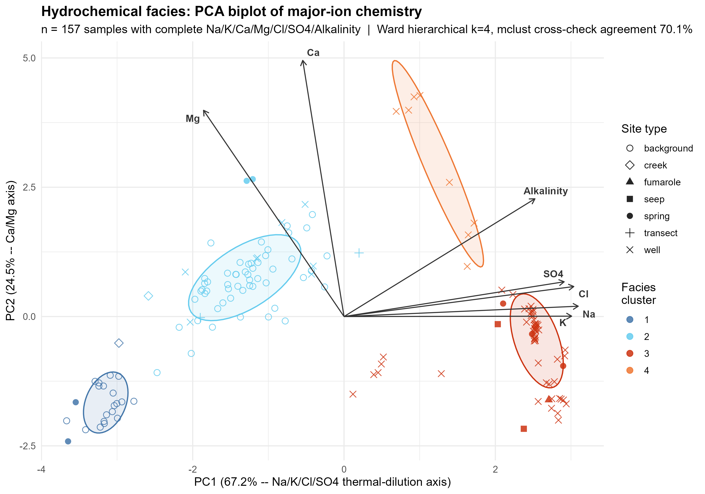
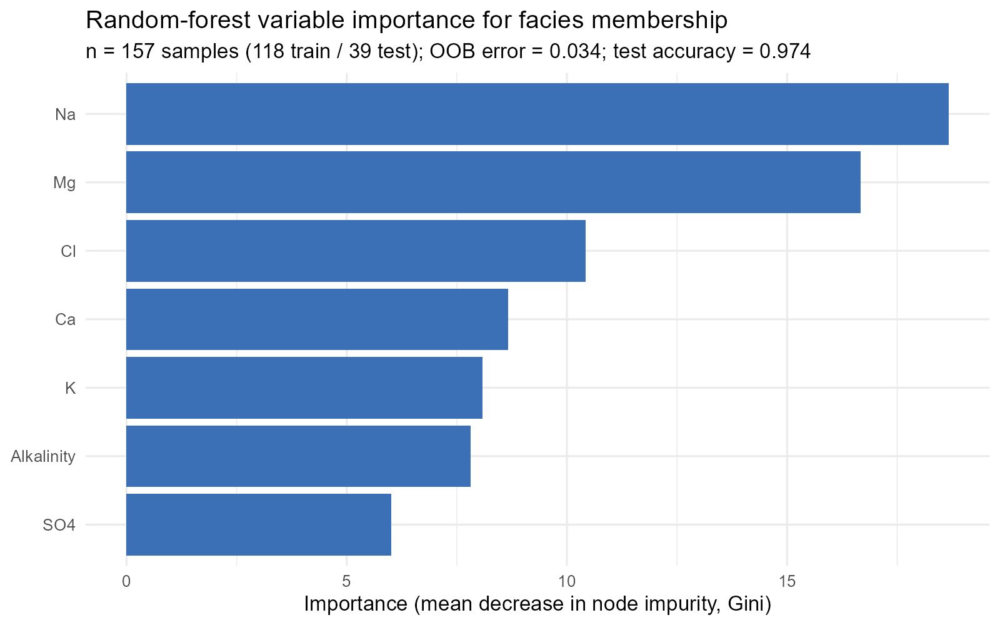

::: {.callout-warning}
## Status: partial draft

This chapter presents the strongest real findings on file today as
figures with concise, question-first prose. It is not yet a complete
results chapter -- several real analyses (the naive Cl-vs-time trend,
the full PHREEQC mixing/inverse runs, barometric efficiency) are
described in prose only, pending a full editorial pass once the ArcGIS
potentiometric-surface and fault-digitizing work (see `ROADMAP.md`)
lands. Every figure below is regenerated on demand from
`scripts/analysis/plot_theme.R` and the notebooks cited in its
caption -- none is a static, hand-made image.
:::

## Has Steamboat's thermal-water signature persisted for three decades?

```{r cl-b-fig}
#| echo: false
#| fig-cap: "Chloride-to-boron ratio in real thermal end-member samples, 1950-2026 (Sorey & Colvard 1992 CPI/SB GEO wells and springs vs. this project's own 2024-2026 FIELD samples; see `notebooks/07`)."
knitr::include_graphics("../output/figures/manuscript/cl_b_ratio_by_era.png")
```

Cl/B is a conservative-element ratio: both chloride and boron behave
as near-inert tracers of the deep thermal fluid, so a stable ratio
across decades is evidence the *same* reservoir fluid is still
discharging, not a chemically different source. A Welch two-sample
t-test on the curated end-member set (n = 7 historical, n = 6 modern,
excluding the Cox well per Sorey & Colvard's own convention and the
SBRR/SBBV creek mixing points) finds the ratio is similar in
magnitude but not statistically identical: 19.6 (1950-1991) vs. 21.9
(2024-2026), t(9.9) = -2.92, p = 0.015. The practical reading is
conservative: this is evidence *against* a wholesale change in source
water, with a small, real shift whose cause (analytical-method
difference vs. a genuine ~12% geochemical shift) is an open question,
not resolved here.

## Do independent geothermometers agree on how much the outflow has cooled?

```{r geo-fig}
#| echo: false
#| fig-cap: "Geothermometer estimates vs. measured discharge temperature, per-well mean across all real thermal samples with complete Na/K/quartz chemistry (see `notebooks/06`)."
knitr::include_graphics("../output/figures/manuscript/geothermometer_comparison.png")
```

Two independent geothermometers -- Na/K (Giggenbach) and
quartz/chalcedony -- are both applied to the same real thermal
samples and compared against each other's *disagreement*, not just
their individual estimates. Quartz sits systematically below measured
discharge temperature (partial re-equilibration/dilution on the way
up) while Na/K sits systematically above it (a deeper, hotter
reservoir signature that re-equilibrates more slowly than silica).
This divergence is itself the finding: it is consistent with a single
cooling/dilution flow path from a genuinely hot (~150-250 C) reservoir,
not two disconnected water types.

## How coarse can chloride sampling be without losing the discharge signal?

```{r sampfreq-fig}
#| echo: false
#| fig-cap: "Monte Carlo reconstruction-error curve for candidate chemistry-sampling intervals, computed from the real ~5-week 2026 SBRR/SBGG specific-conductance record (see `notebooks/09`)."
knitr::include_graphics("../output/figures/manuscript/sampling_frequency_error_curve.png")
```

This directly answers the thesis's own sampling-design question, using
specific conductance as a stand-in dense proxy since no dense real
chloride series exists yet. Daily sampling keeps reconstruction error
under ~5% of the mean at both logger sites; weekly sampling costs
~6-8%; the error grows smoothly rather than showing a sharp cliff at
any one interval. This motivates the two-tier calibration-sampling
recommendation in `manuscript/06_calibration_sampling_proposal.qmd`
(an intensive daily/sub-daily 2-4 week window, followed by biweekly-
to-monthly ongoing sampling).

## Hydrochemical facies: does unsupervised clustering recover known geochemistry?

```{r facies-pca-fig}
#| echo: false
#| fig-cap: "PCA biplot of major-ion chemistry (157 samples with complete Na/K/Ca/Mg/Cl/SO4), colored by the persisted hydrochemical-facies cluster assignment (see `notebooks/07`, `08`)."

```

```{r facies-rf-fig}
#| echo: false
#| fig-cap: "Random-forest variable importance for hydrochemical-facies membership (see `scripts/analysis/facies_random_forest.R`)."

```

Clustering every real sample with complete major-ion chemistry into
hydrochemical facies (Ward hierarchical clustering, k selected by
silhouette width, cross-checked against an independent Gaussian
mixture fit and k-means) recovers a pure Na-Cl thermal cluster, a
dilute background-water cluster, and an intermediate/mixed cluster
without being told the samples' site types in advance. PCA
independently confirms the same structure: PC1 (Cl/Na/K/SO4, the
thermal-dilution axis) and PC2 (Ca/Mg) together explain ~97% of
variance, and the clusters separate cleanly along PC1. A random-forest
classifier trained on the same seven major ions ranks Na, Cl, and K as
the strongest discriminators of facies membership, consistent with the
same thermal-dilution axis PCA finds -- three independent methods
(PCA, unsupervised clustering, and supervised variable importance)
converging on the same chemical explanation is a real, non-trivial
cross-validation of the underlying pattern, not an artifact of any one
method's own assumptions.

## What these results do not yet show

Stated plainly, for scope: a naive Cl-vs-year regression across all
thermal-influenced samples is only marginally significant once known
confounders are excluded (`notebooks/07`, `08` walk through why, and
disagree with each other on the honest interpretation) -- this project
does **not** yet claim a confirmed multi-decade chloride trend, and
this chapter will not overstate one. Real two-end-member PHREEQC
mixing and inverse-modeling runs exist (`notebooks/06`) but use a
representative, not a time-paired, end-member set, since no real
chemistry sample yet overlaps the conductivity-logger deployment
window closely enough to name a confident synoptic pair. Both are
flagged here rather than silently omitted.
