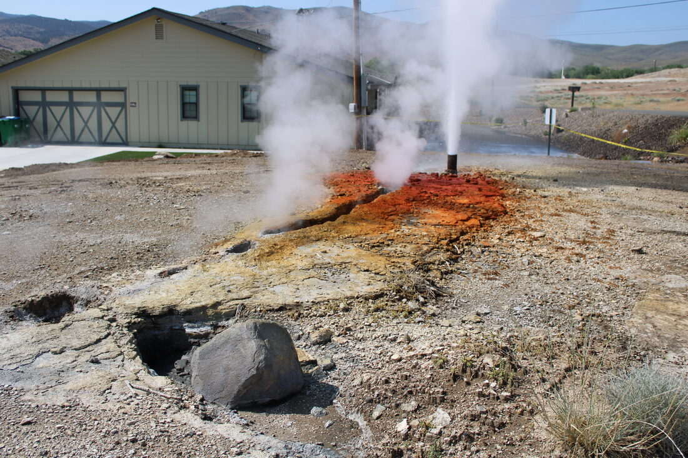
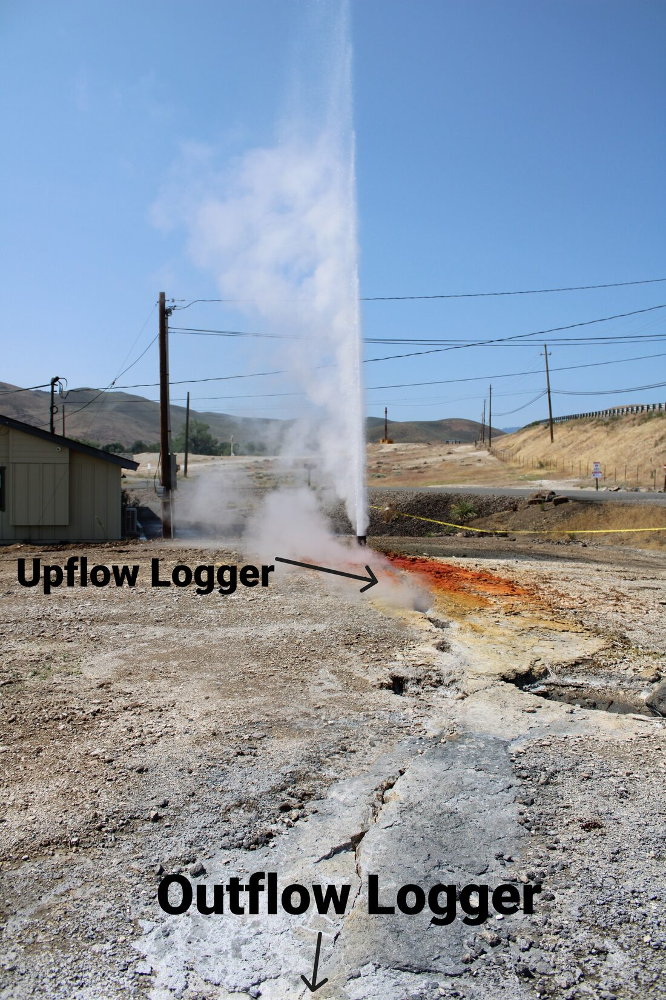
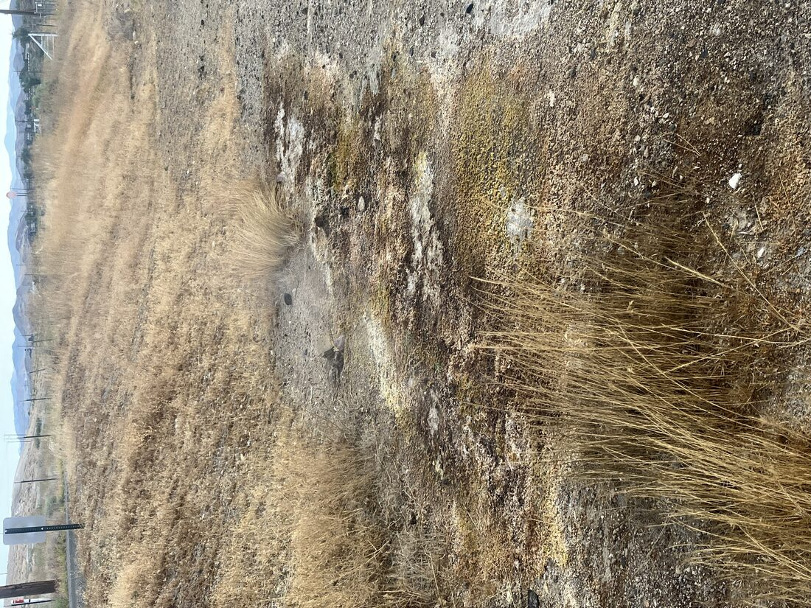
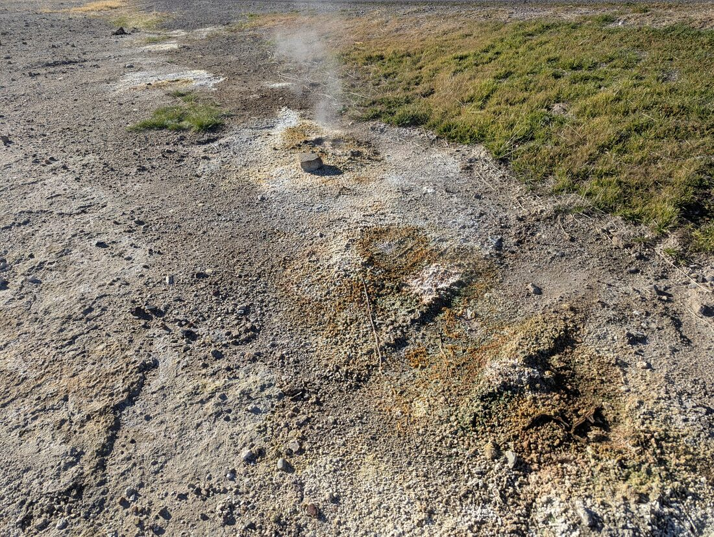
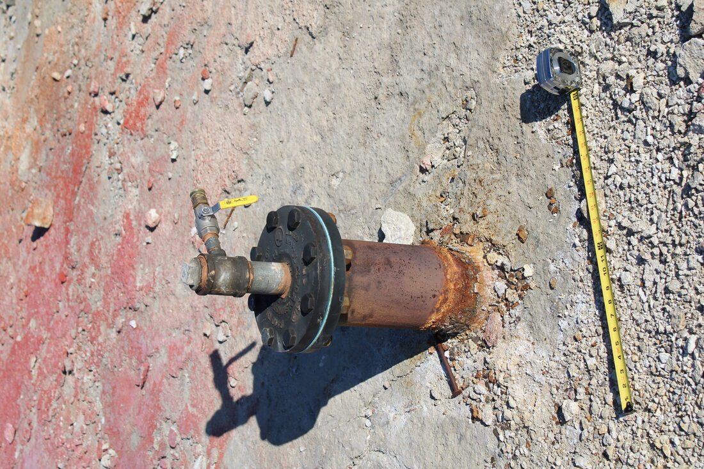

```{r setup, include=FALSE}
knitr::opts_chunk$set(echo = FALSE, message = FALSE, warning = FALSE)
```

## From First Signs to Standing Monitoring Network

The events below are placed using each photo's own embedded capture timestamp (and, where present, its embedded GPS fix), not a remembered or estimated date, so this timeline can be extended reliably as new field photos and videos come in. It runs from the first documented signs of renewed activity through the point where this project's own continuous monitoring network took over. Lindsey et al. (2026) is the fullest published account of the earlier part of this story and is cited throughout; see the [References](references.html) page for the full citation.

<div class="timeline">

<div class="timeline-item">
<div class="timeline-date">2022</div>
<div class="timeline-content">
<h4>Renewed Steaming Ground First Noted</h4>
<p>Per Lindsey et al. (2026), steaming ground at the Lower Sinter Terrace began expanding and water reappeared along surface fractures, reversing decades of quiet decline in the field's surface expression. Activity increased steadily over the following three years.</p>
</div>
</div>

<div class="timeline-item">
<div class="timeline-date">June 3, 2025</div>
<div class="timeline-content">
<h4>The Lower Sinter Terrace Eruption</h4>
<p>An uncapped, shallow (roughly 15-20 m) abandoned well erupted without warning, shooting boiling water nearly 30 m into the air. It was the first geyser-like activity documented at Steamboat in decades (Lindsey et al., 2026). The response effort that produced this project's own monitoring network began immediately afterward.</p>
</div>
</div>

<div class="timeline-item">
<div class="timeline-date">June 6, 2025</div>
<div class="timeline-content">
<h4>Early Site Documentation and Drone Survey</h4>

<p>The active vent three days after the eruption, still uncapped and jetting from the well pipe next to Ormat facility buildings. Fresh orange and yellow sinter mineralization fans out across the surrounding pad, with yellow caution tape marking the exclusion zone.</p>

<p>The same vent, annotated to mark the planned placement of upflow and outflow temperature loggers relative to the eruption fissure. This is the beginning of the continuous temperature-monitoring effort this project builds on directly.</p>
<video controls preload="metadata" class="timeline-video" poster="assets/thumbs/geyser_fissure_south_view_5.jpg">
<source src="assets/video_compressed/drone_survey_20250606.mp4" type="video/mp4">
Your browser does not support embedded video.
</video>
<p>Aerial drone survey of the eruption site taken the same day (the file's embedded metadata timestamp reads August 22, 2025, which reflects when the clip was downloaded/exported from the drone, not when it was flown). Lindsey et al. (2026) describe thermal drone surveys as one of the core tools in the post-eruption monitoring program this footage belongs to.</p>
</div>
</div>

<div class="timeline-item">
<div class="timeline-date">Shortly after June 6, 2025</div>
<div class="timeline-content">
<h4>The Pipe Is Capped, Discharge Redistributes</h4>
<p>Per Lindsey et al. (2026), the erupting pipe was capped in the days or weeks following the eruption (an exact date is not given in the published account). Capping did not stop the discharge; it shifted laterally, with new small springs and persistent spitting vents forming along adjacent fractures and sinter surfaces nearby. That redistribution, not a second eruption, is what the next photo documents.</p>
</div>
</div>

<div class="timeline-item">
<div class="timeline-date">June 14, 2025</div>
<div class="timeline-content">
<h4>Steaming Ground Beyond the Main Vent</h4>

<p>Sulfur-stained, steaming ground along a fence line near the site, distinct from the now-capped main vent: exactly the kind of lateral redistribution of discharge Lindsey et al. (2026) describe following capping, rather than activity confined to a single point.</p>
</div>
</div>

<div class="timeline-item">
<div class="timeline-date">December 12, 2025</div>
<div class="timeline-content">
<h4>Persistent Steaming Ground, GPS-Located</h4>

<p>Mineral-encrusted ground and a small steaming vent, six months after the eruption, at 39.3823&deg; N, 119.7389&deg; W. This is the only asset on this page with an embedded GPS fix, extracted automatically via the same EXIF pipeline used for this project's registered field locations.</p>
</div>
</div>

<div class="timeline-item">
<div class="timeline-date">January 22, 2026</div>
<div class="timeline-content">
<h4>Wellhead Follow-up and Active Steaming Fissure</h4>

<p>The same wellhead, capped since mid-2025 and now fitted with a valve, measured against a tape for scale during a routine follow-up visit roughly seven months after the eruption; not a new capping event, just a later inspection of the same structure. A companion visit the same day documented the nearby steaming fissure still actively bubbling and spouting intermittently, more than half a year after the initial eruption.</p>
</div>
</div>

<div class="timeline-item">
<div class="timeline-date">February 2026</div>
<div class="timeline-content">
<h4>Lindsey et al. Published</h4>
<p>Cary R. Lindsey, Owen Callahan, Rachel Micander, Nicole Hart-Wagoner, and Griffin Burke-Ruhl presented <em>Recent Geyser-Like Eruption and Renewed Hydrothermal Activity in the Steamboat Geothermal Area, Nevada</em> at the 51st Stanford Geothermal Workshop (SGP-TR-230), the first full published account of the eruption and the monitoring program that followed it. This project continues that program's chemistry, temperature, and mapping threads with its own database and analysis pipeline.</p>
</div>
</div>

<div class="timeline-item">
<div class="timeline-date">2026 (ongoing)</div>
<div class="timeline-content">
<h4>This Project's Monitoring Network</h4>
<p>Temperature loggers, a conductivity logger in Steamboat Creek, re-mapped springs and wells, and a growing chemistry record extend the Lindsey et al. (2026) response effort into a standing, reproducible monitoring system. See the [Data System](data.html) and [Results](results.html) pages for what that network shows so far.</p>
</div>
</div>

</div>

## Turning This Documentation Into Map Points

Every photo above already carries an exact capture timestamp, and one also carries a GPS coordinate extracted directly from the file's own metadata. That extraction runs through the same `ingest_image_locations.R` pipeline used for every other field photo in this project (documented in full on the [Pipeline](pipeline.html) page); no coordinate on this page was typed in by hand. As of this update, that pipeline also scans video files for embedded GPS the same way it already handled still images. All seven files on this page (five photos, two videos) have been run through it directly: it correctly read the one real GPS fix present, and quietly skipped the six files with no location tag at all rather than erroring, which is exactly the behavior a mixed photo/video drop folder needs. Most drone and phone videos checked so far, including the drone survey above, simply carry no embedded location metadata, so a video becomes a mapped point only once someone assigns it a coordinate or an existing station code by hand in `image_location_map.csv`, the same review step every photo already goes through before it can create or check a `Locations` row. This page's timeline and the database's spatial layer are built from that same underlying mechanism, just applied to documentation photos and videos instead of routine field-visit photos.
